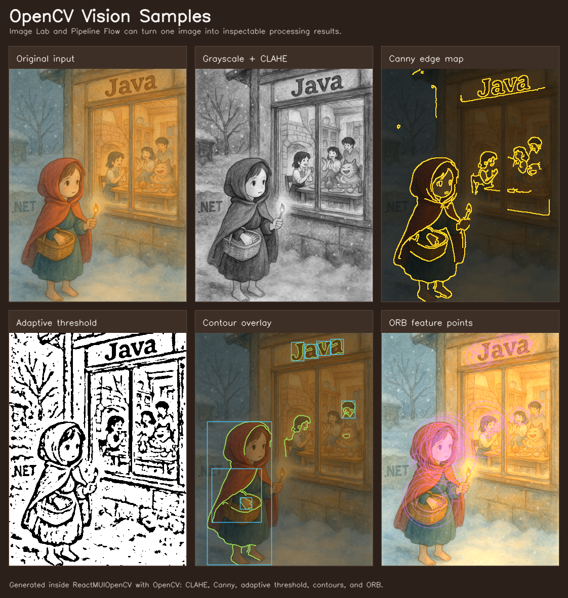

# ReactMUIOpenCV

React + TypeScript + MUI UI, WebView2 desktop host, C++20 + CMake + OpenCV backend를 한 저장소에서 함께 빌드하는 Windows-first 비전/미디어 테스트베드입니다.

이 문서는 새 Windows PC에 VS Code와 Git만 먼저 설치되어 있고, GitHub에서 이 저장소를 내려받은 상태를 기준으로 설명합니다. CMake, Node.js, Visual Studio C++ Build Tools, WebView2 Runtime은 `scripts\bootstrap.ps1`이 `winget`으로 확인하거나 설치합니다. 따라서 App Installer/winget, 인터넷 연결, 설치 권한은 필요하며, 회사 보안 정책 때문에 자동 설치가 막히는 PC에서는 필요한 도구를 직접 설치한 뒤 `-SkipToolInstall`로 프로젝트 의존성만 준비할 수 있습니다. 모든 실제 작업 스크립트는 `scripts/` 아래에 있습니다. 루트 `build.ps1`은 기존 VS Code/문서 호환을 위한 얇은 위임 스크립트입니다.

## 한눈에 보는 OpenCV 쇼케이스

Image Lab에서 이미지를 열거나 업로드하면 C++ OpenCV 백엔드가 필터, 특징점, 윤곽선, 임계값 처리 같은 결과를 만들고 React UI가 같은 결과를 데스크톱 앱과 브라우저에서 보여줍니다. Pipeline Flow에서는 같은 연산을 노드로 연결해 단계별 미리보기와 메타데이터를 재사용할 수 있습니다.



위 샘플은 하나의 입력 이미지에 OpenCV `CLAHE`, `Canny`, adaptive threshold, contour detection, `ORB` feature detection을 적용한 README용 예시입니다. GitHub 저장소 첫 화면에서 이 프로젝트를 이미지 처리 실험실, 비전 파이프라인, LAN 공유 미리보기 도구로 확장할 수 있다는 감을 바로 주기 위한 정적 샘플입니다. 같은 형태의 결과는 앱의 Image Lab에서 `Vision Sample Board` 연산으로 생성할 수 있으며, 조작 방법은 `docs\OPENCV_README_SAMPLE_GUIDE.md`에 정리되어 있습니다.

Image Lab의 `Optional DNN Examples`에서는 공개 저장소 기반 모델 패키지를 선택해 `models\dnn` 아래로 내려받고, face detection, YOLO object detection, EAST text detection, OpenPose pose estimation, Mask R-CNN 예제를 바로 실행할 수 있습니다. 대용량 모델 파일은 Git에 포함하지 않으며, 앱은 고정 카탈로그 URL만 다운로드합니다.

## 빠른 시작

PowerShell을 열고 저장소 루트에서 실행합니다.

```powershell
powershell -ExecutionPolicy Bypass -File .\scripts\bootstrap.ps1
```

위 명령은 다음을 순서대로 준비합니다.

1. winget으로 Node.js LTS, CMake, Visual Studio 2022 Build Tools, WebView2 Runtime을 확인하거나 설치합니다.
2. WebView2 SDK를 NuGet 패키지에서 받아 `%USERPROFILE%\.nuget\packages` 아래에 준비합니다.
3. `frontend\node_modules`를 준비합니다.
4. `.tools\vcpkg`를 clone/bootstrap합니다.
5. `frontend\dist`를 빌드합니다.
6. CMake로 Release backend와 WebView2 desktop app host를 빌드합니다.

처음 실행은 npm, vcpkg, OpenCV 빌드 때문에 오래 걸릴 수 있습니다.

빌드가 끝난 뒤 실행합니다.

```powershell
# WebView2 데스크톱 앱 실행
powershell -ExecutionPolicy Bypass -File .\scripts\start.ps1 -Mode App -Release

# 브라우저 웹 모드 실행
powershell -ExecutionPolicy Bypass -File .\scripts\start.ps1 -Mode Web -Release

# LAN Web UI 모드 실행
powershell -ExecutionPolicy Bypass -File .\scripts\start.ps1 -Mode Lan -Release
```

기본 접속 주소는 `http://127.0.0.1:18730`입니다.

## 저장소를 처음 받은 뒤 권장 순서

```powershell
git clone <repo-url>
cd ReactMUIOpenCV
powershell -ExecutionPolicy Bypass -File .\scripts\bootstrap.ps1
powershell -ExecutionPolicy Bypass -File .\scripts\start.ps1 -Mode App -Release
```

VS Code에서 바로 열려면:

```powershell
code .
```

VS Code 추천 확장은 `.vscode/extensions.json`에 들어 있습니다.

## 주요 스크립트

| 스크립트 | 용도 |
| --- | --- |
| `scripts\bootstrap.ps1` | 새 Windows PC 초기 셋업. 도구 설치, WebView2 SDK, npm deps, vcpkg, Release 빌드까지 수행 |
| `scripts\install-windows-prereqs.ps1` | winget 기반 Windows 개발 도구 설치 |
| `scripts\setup-webview2-sdk.ps1` | WebView2 SDK NuGet 패키지 다운로드 및 추출 |
| `scripts\ensure-frontend-deps.ps1` | `frontend\node_modules`가 없거나 오래되면 `npm install` 실행 |
| `scripts\setup-vcpkg.ps1` | workspace-local `.tools\vcpkg` clone/bootstrap |
| `scripts\prepare-debug.ps1` | VS Code 디버그 전 의존성 확인, typecheck, CMake configure/build, exe 검증 |
| `scripts\configure-backend.ps1` | 설치된 Visual Studio 중 지원 가능한 최신 CMake generator를 선택해 backend configure |
| `scripts\build-backend.ps1` | backend Debug 또는 Release 빌드 |
| `scripts\build.ps1` | Release 빌드. frontend production bundle + backend Release exe 생성 |
| `scripts\start.ps1` | Debug/Release 산출물 실행. App/Web/Lan 모드 지원 |
| `scripts\run-backend.ps1` | 가장 최근 빌드된 backend exe를 찾아 직접 실행 |
| `scripts\publish.ps1` | `/publish` 아래 휴대용 배포 번들과 zip 생성 |

호환용 루트 명령도 유지됩니다.

```powershell
.\build.ps1
```

이 명령은 내부적으로 `scripts\build.ps1`을 호출합니다.

## bootstrap 옵션

도구 설치는 이미 끝났고 프로젝트 의존성만 다시 준비하려면:

```powershell
powershell -ExecutionPolicy Bypass -File .\scripts\bootstrap.ps1 -SkipToolInstall
```

빌드는 건너뛰고 의존성만 준비하려면:

```powershell
powershell -ExecutionPolicy Bypass -File .\scripts\bootstrap.ps1 -SkipBuild
```

빌드 후 바로 실행하려면:

```powershell
powershell -ExecutionPolicy Bypass -File .\scripts\bootstrap.ps1 -RunAfterBuild -RunMode App
powershell -ExecutionPolicy Bypass -File .\scripts\bootstrap.ps1 -RunAfterBuild -RunMode Web
```

## 개발 모드

Debug 빌드를 준비합니다.

```powershell
powershell -ExecutionPolicy Bypass -File .\scripts\prepare-debug.ps1
```

React 개발 서버를 실행합니다.

```powershell
cd frontend
npm run dev
```

C++ 백엔드를 실행합니다.

```powershell
.\backend\out\build\windows-msvc-vcpkg\Debug\ReactMUIOpenCV.exe
```

또는:

```powershell
powershell -ExecutionPolicy Bypass -File .\scripts\start.ps1 -Mode Web
```

VS Code에서는 Run and Debug 패널에서 다음 구성을 사용할 수 있습니다.

- `Debug Desktop App`
- `Debug Backend`
- `Debug Backend LAN`
- `Debug Web Mode (Frontend + Backend)`
- `Debug LAN Web Mode`

## Release 빌드

```powershell
powershell -ExecutionPolicy Bypass -File .\scripts\build.ps1
```

결과:

```txt
frontend/dist/
backend/out/build/windows-msvc-vcpkg/Release/ReactMUIOpenCV.exe
backend/out/build/windows-msvc-vcpkg/Release/ReactMUIOpenCVApp.exe
```

`ReactMUIOpenCVApp.exe`는 WebView2 SDK가 준비되어 있을 때 생성됩니다. `scripts\bootstrap.ps1`은 기본적으로 SDK를 준비합니다.

## 배포 번들 생성

```powershell
powershell -ExecutionPolicy Bypass -File .\scripts\publish.ps1
```

결과:

```txt
publish/
├─ ReactMUIOpenCV/
├─ ReactMUIOpenCV-{version}.zip
└─ ReactMUIOpenCV-latest.zip
```

배포 폴더에는 데스크톱 앱, 웹 모드, LAN 모드 시작 스크립트가 포함됩니다.

## 헬스 체크

백엔드 실행 후 확인합니다.

```powershell
Invoke-RestMethod http://127.0.0.1:18730/api/health
```

React UI는 다음 주소에서 확인합니다.

```txt
http://127.0.0.1:18730
```

개발 서버는 다음 주소를 사용합니다.

```txt
http://127.0.0.1:5173
```

## LAN 모드 주의사항

LAN 모드는 backend를 `0.0.0.0`에 바인딩합니다.

```powershell
powershell -ExecutionPolicy Bypass -File .\scripts\start.ps1 -Mode Lan -Release
```

신뢰할 수 있는 개인 네트워크에서만 사용하세요. Windows 방화벽 알림이 뜨면 개인 네트워크만 허용하고 공용 네트워크는 차단하는 것을 권장합니다.

## 문제 해결

### winget이 없다고 나옴

Microsoft Store에서 App Installer를 설치하거나, Node.js LTS, CMake, Visual Studio 2022 Build Tools, WebView2 Runtime을 직접 설치한 뒤 실행합니다.

```powershell
powershell -ExecutionPolicy Bypass -File .\scripts\bootstrap.ps1 -SkipToolInstall
```

### CMake generator 오류가 남

프로젝트 스크립트는 설치된 Visual Studio 중 CMake가 지원하는 최신 generator를 자동 선택합니다. Visual Studio 2022 Build Tools 이상의 C++ workload와 Windows SDK가 설치되어 있어야 합니다. 여러 Visual Studio 버전이 섞인 PC에서 generator가 바뀌면 스크립트가 `backend\out\build` 아래의 생성된 CMake 캐시를 정리하고 다시 configure합니다.

### WebView2 앱 exe가 안 생김

다음을 실행해 SDK를 다시 준비합니다.

```powershell
powershell -ExecutionPolicy Bypass -File .\scripts\setup-webview2-sdk.ps1
powershell -ExecutionPolicy Bypass -File .\scripts\build.ps1
```

### UI가 안 보이고 안내 문구만 나옴

`frontend\dist`가 없을 가능성이 큽니다.

```powershell
powershell -ExecutionPolicy Bypass -File .\scripts\build.ps1
```

### npm 또는 vcpkg 다운로드가 실패함

초기 셋업에는 인터넷 연결이 필요합니다. 회사 프록시나 방화벽 환경에서는 GitHub, npm registry, NuGet, vcpkg dependency 다운로드가 허용되어야 합니다.

## 추가 문서

- `docs\USER_GUIDE.md`: 사용자 가이드
- `docs\DEVELOPER_SETUP_GUIDE.md`: 개발자 초기 셋업 상세 문서
- `docs\BUILD_AND_DEBUG_POLICY.md`: 빌드/디버그 정책
- `docs\PUBLISHING.md`: 배포 번들 생성 및 검증
- `docs\CODING_GUIDE.md`: 구현 규칙
- `docs\OPENCV_README_SAMPLE_GUIDE.md`: README OpenCV 샘플 이미지 재생성 가이드
